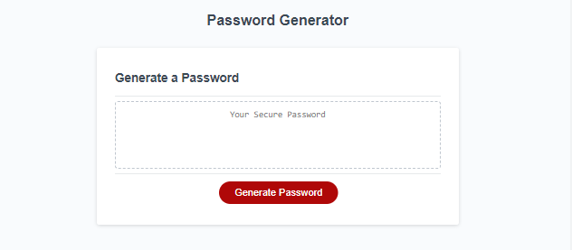

# Password Generator - JavaScript

## Description
Password Generator - JavaScript project consists in developing a code in JavaScript to generate a random password on a webpage based on two criterias: password lenght and character types. The code created to generate passwords is limited to basic JavaScript language such as function, if statement, for loop and others. This project is part of a challenge from Full Stack Coding Bootcamp at the University of Minnesota.

## Installation

N/A

## Usage
To generate a password a user should do the following:
1. Click on the 'Generate Password' button on screen. A prompt will appear asking the user's desired password length (the length should be between 8 and 128 characters).
    * If the user chooses a lenght lower than 8 or higher than 128, they will be asked to click on 'Generate Password' button again to restart process.
    * If the user cancels or does not add any information to the prompt, the prompt will close.
1. A series of four prompts will appear to determine the character type the user wishes to have in the password (lowercase, upercase, number and/or special character).
    * If all prompts are canceled, meaning no character type is selected, user will be informed that at least one type should be selected and asked to click on 'Generate Password' button again to restart process.
1. If a valid lenght is provided and at least one character type is selected, a random password will be generated based on those criterias (length and type) and shown on the webpage.

## Credits

N/A

## License

Please refer to the LICENSE in the repo.

## Link to live website

## Website preview

